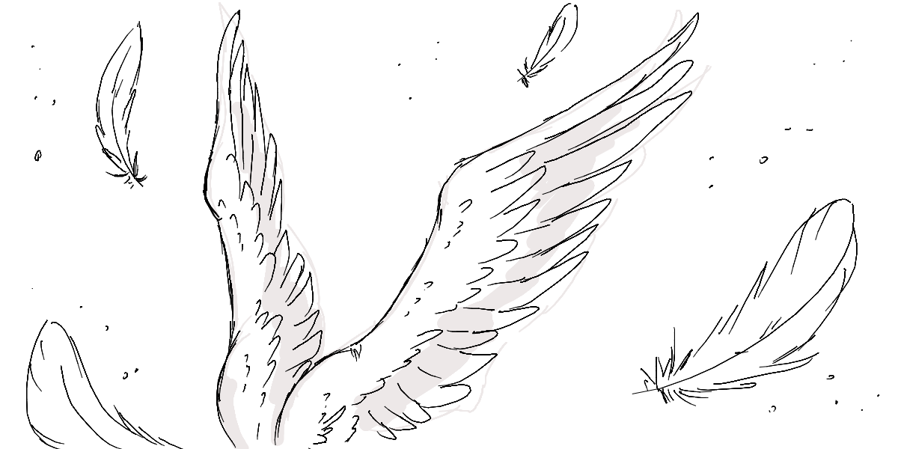
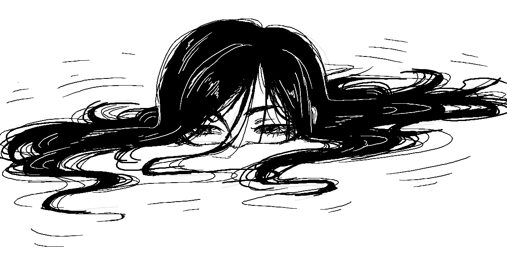
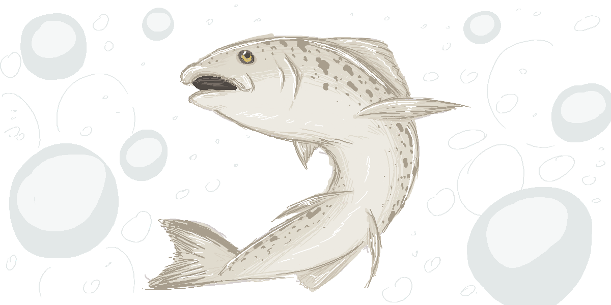

<h1>Xibit: A Social Platform for Artists</h1>

<b>Klaudia Kulas</b> - Front End and General Design

<b>Robert Coughlan</b> - JavaScript Back End

<b>Dylan Mulcahy</b> - Python Back End

<b>Darragh Hession</b> - Server and Database Management

<h2>Our Vision</h2>

As technology advanced, artists migrated to social media for recognition from people all around the world. This was a huge benefit, however new issues arose. Tracing, photoshopping and AI all became common and troublesome problems for artists.

This is where Xibit comes in. Xibit is a solution, a fun place for artists to interact and share their artwork. With our art tool integrated into the Xibit website, tracing, copying and the use of AI isn't possible. Users can scroll with confidence that all artwork on Xibit is true to the artists real skill.

<h2>What Does Xibit Offer?</h2>

Xibit offers its users a range of artistic tools, a customizable feed, social aspects and profile customization!

<h3>Art Tool</h3>

Xibit has a JavaScript canvas integrated art tool which allows users to create their own artwork. A range of useful tools such as a brush, eraser, shapes and a color picker are there to choose from! Once the your drawing is complete, you can save and also post the artwork for other users to see!

<h3>Profile</h3>

Each user is able to customize their own profile however they like. You are able to choose a profile picture, a display name and a short biography to introduce yourself! All of your artworks are displayed to the right of your profile so that users can view everything that you have created.

<h3>Feed</h3>

The feed allows you to view everybody's artwork! With the ability to search by tags and sort artworks, Xibit is very fair to it's users by not prioritizing top posts over others. As the user you can sort posts from newest, oldest, most liked and posts only by people from your friends list! You are able to like posts, comment on them and view their artists profile to see even more.

<h2>Featured Artworks</h2>

Below if a few artworks created using Xibit!

